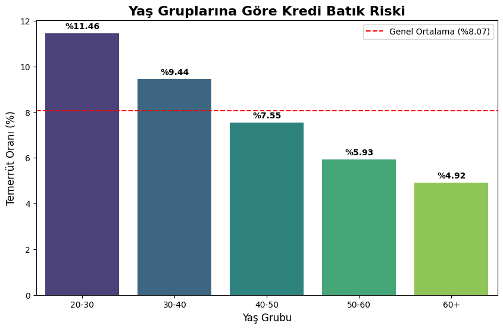
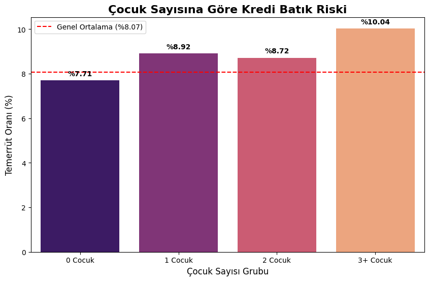
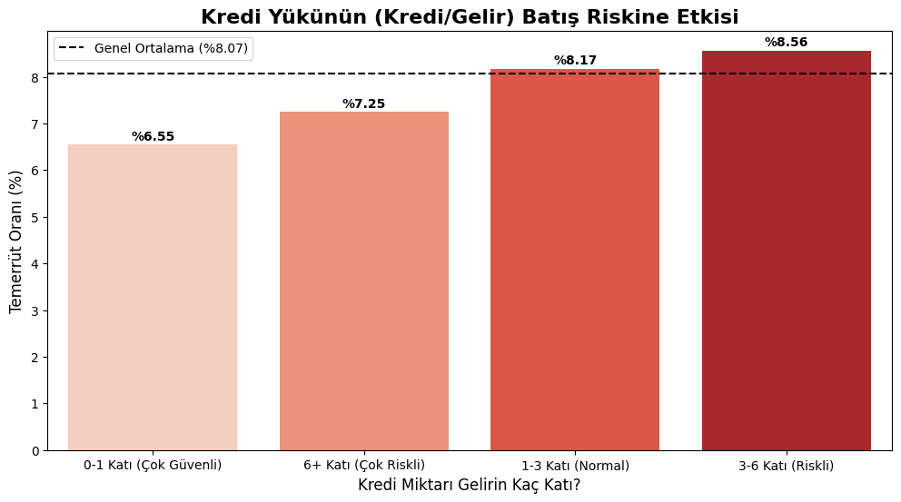
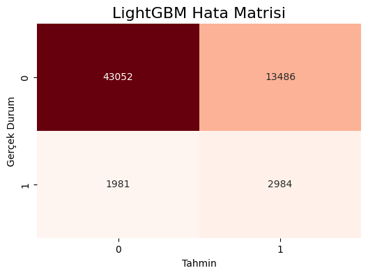
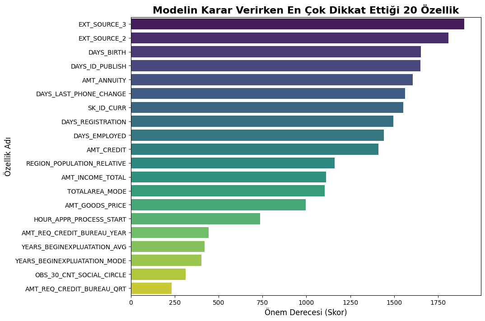

> 🇹🇷 **Türkçe dokümantasyon için [buraya tıklayın](README_TR.md).**

# 🏦 Home Credit Default Risk Analysis | End-to-End ML Project

## 📌 Project Overview
The primary goal of this project is to solve a critical problem in the banking sector: **Credit Default Risk Prediction.**
Using historical data provided by Home Credit, I analyzed customer behaviors and built a Machine Learning model to predict whether a borrower will repay their loan or default.

This project goes beyond simple modeling; it involves deep **SQL Analysis**, **Feature Engineering**, and handling **Imbalanced Data** using advanced Boosting algorithms.

---

## 🛠️ Tech Stack & Workflow
* **Data Analysis:** SQL (SQLite) & Python (Pandas)
* **Visualization:** Matplotlib & Seaborn
* **Machine Learning:** Random Forest & **LightGBM** (Gradient Boosting)
* **Technique:** Class Weighting for Imbalanced Data, Threshold Tuning

---

## 📊 1. Exploratory Data Analysis (EDA) & Key Insights
Before feeding the data into the model, I conducted a detailed analysis using SQL and Python to understand risk factors.

### 🚩 Insight 1: Age vs. Risk
**Observation:** Younger clients (<30 years) are significantly riskier than older clients (>60 years).
* **20-30 Years Old:** 11.46% Default Rate
* **60+ Years Old:** 4.92% Default Rate

### 🚩 Insight 2: Family Status Impact
**Observation:** There is a correlation between the number of children and default risk. Families with 3+ children show the highest default probability (%10.04).

### 🚩 Insight 3: Credit-to-Income Ratio & "Survivor Bias"
**Observation:** Surprisingly, people requesting loans **6+ times** their income have a lower risk than those requesting **3-6 times**.
**Interpretation:** This indicates strict bank policies; only highly qualified customers are approved for such large loans (Survivor Bias).

---

## 🧠 2. Model Performance (The Solution)
The dataset was highly imbalanced (only ~8% defaults). A standard model would fail to detect risky customers (High Accuracy, Low Recall).
I used **LightGBM** with `class_weight='balanced'` and `scale_pos_weight` to solve this.

### 🏆 Final Results
| Metric | Score | Description |
| :--- | :--- | :--- |
| **ROC-AUC** | **%75.26** | Strong ability to distinguish between classes. |
| **True Positives** | **2,984** | Potential defaulters successfully detected. |
| **False Negatives** | **1,981** | Missed defaults (reduced significantly from baseline). |

### 📉 Confusion Matrix
The model successfully identified **2,984** risky customers who would have otherwise caused financial loss.

---

## 🔑 3. Feature Importance (Why did the model decide?)
To provide business value, we must explain the "Why". The LightGBM model prioritized the following features:

1.  **EXT_SOURCE (1, 2, 3):** External credit scores are the strongest predictors.
2.  **DAYS_BIRTH:** Age is a critical demographic factor.
3.  **AMT_ANNUITY:** The burden of monthly payments affects repayment capability.

---

## 🚀 Conclusion & Business Impact
By transitioning from a baseline Random Forest to a tuned **LightGBM** model, we increased the detection of risky customers from **near zero to ~60%**. 
Implementing this model can help the bank:
* **Minimize Non-Performing Loans (NPL).**
* **Optimize Interest Rates** based on risk profiles.
* **Automate** the initial credit screening process.

---
*Author: [Mehmet Can Mutlu]*